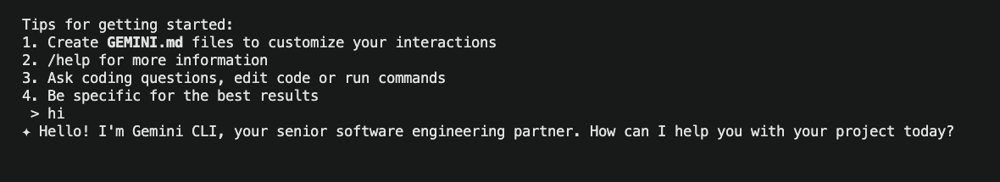
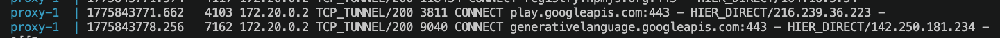
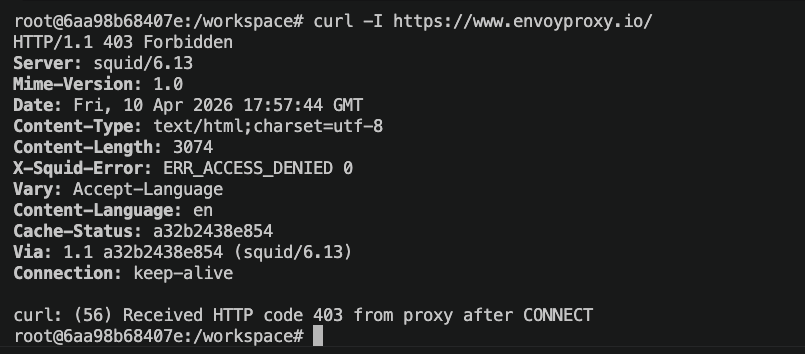
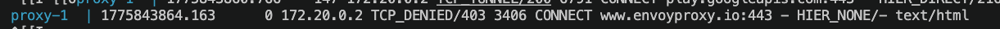

# Workspace

Sandbox environment designed to safely work with AI agents

## Features:
- Network isolation - primary `workspace` container is in private network with no internet access, all internet traffic goes through `proxy` squid proxy container with domain allowlisting functinality that is outside of AI agent reach
- Filesystem isolation via containerization - Only one `./projects` directory is mounted from host filesystem, for other projects to be worked on. This meta scafollding project is not mounted inside a container.

## Quick Start

1. Install requirements: docker, docker compose
2. Set up environment variables `cp example.env .env` - fill missing values, e.g. `GEMINI_API_KEY`
3. Scaffold infrastructure: `docker compose up -d`
4. Start working within container: `docker compose exec workspace bash`

## Commands

- `docker compose build`
- `docker compose up -d`
- `docker compose exec workspace bash`
- `docker compose logs -f proxy`

## DNS White Listing

By default requests are denied, unless present in `allowed-sites.txt`

### Allow

### Deny

### Allowlisting Domains

1. Check the proxy logs if requests are blocked: `docker compose logs -f proxy`
2. Add additional domains by extending `allowed-sites.txt`

For example to allow package installation `apt install cowsay` - `.ports.ubuntu.com` could be added.
